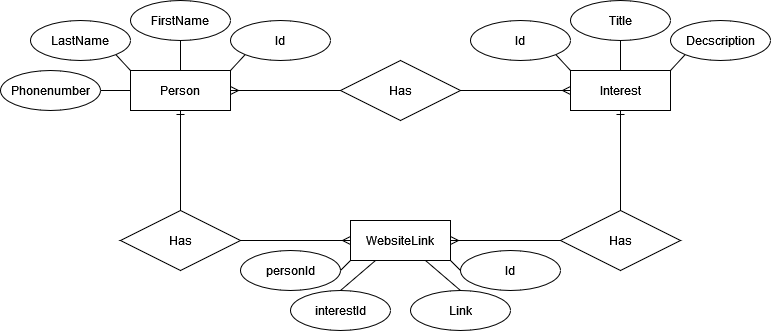
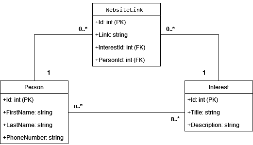

# Lab03MiniprojektAPI
School assiment to make my first API, using REST-architecturee.

# Assigment goals
- Retrieve all persons in the database  
https://localhost:xxxx/person  
- Retrieve all interests associated with a specific person  
https://localhost:xxxx/person/{personId}/interest  
- Retrieve all links associated with a specific person  
https://localhost:xxxx/person/{personId}/link  
- Associate a person with a new interest  
// Make a new interest  
https://localhost:xxxx/person/{personId}/interest  
JSON exampel  
{  
	"title":"Space Exploration",  
	"description":"A fascination with the exploration of outer space, including astronomy, space   missions, and the search for extraterrestrial life"  
}   
or  
// Connect to existing interest  
https://localhost:xxxx/person/{personId}/interest/{interestId}  
- Insert new links for a specific person and a specific interest  
https://localhost:xxxx/person/{personId}/interest/{interestId}/link

# ER-Diagram

# UML-Diagram
